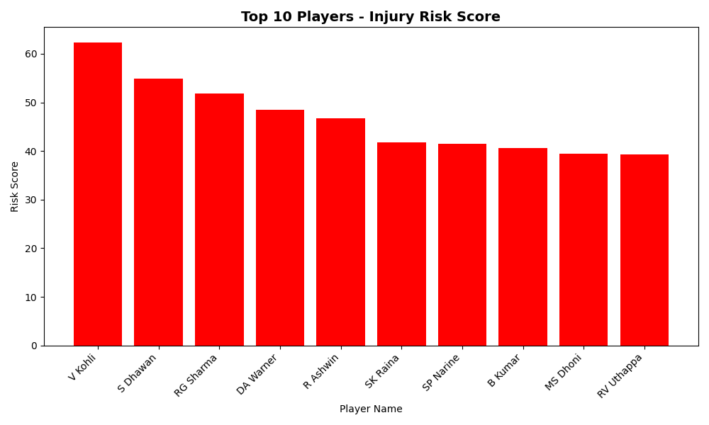

# SL-Injury-Risk-Dashboard
Cricket Injury Risk Prediction Dashboard using ML and Streamlit
# SL Injury Risk Dashboard

A Machine Learning powered dashboard to predict Sports Injury Risk using player workload and fitness data.

## Features
- **ML Model**: Predicts injury risk based on workload, sleep, and fatigue
- **Streamlit Dashboard**: Interactive UI with charts and filters
- **Data Visualization**: Player performance and risk graphs

## Tech Stack
Python, Pandas, Scikit-learn, Streamlit, Matplotlib

## How to Run
```bash
pip install streamlit pandas scikit-learn
streamlit run dashboard.py
## Demo
